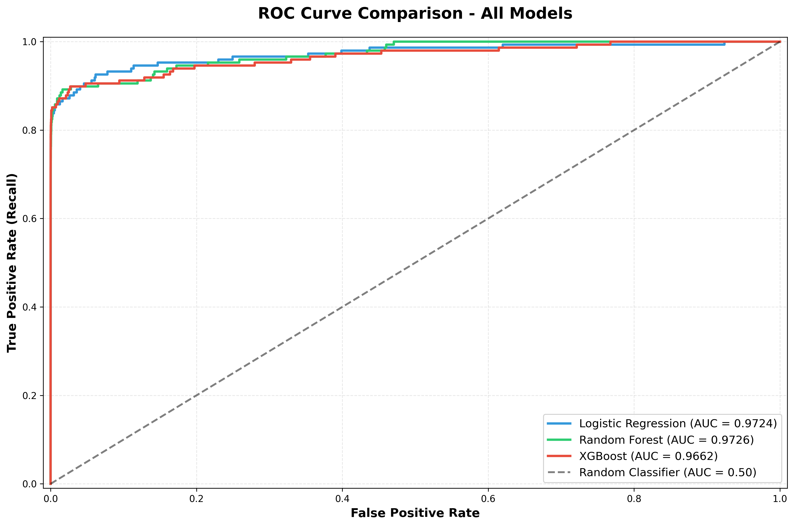
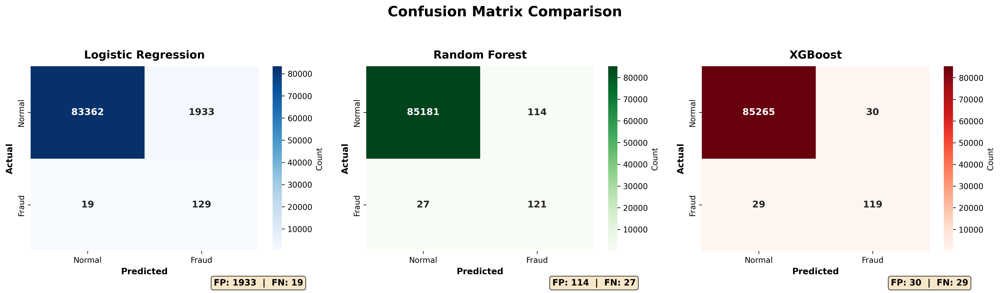
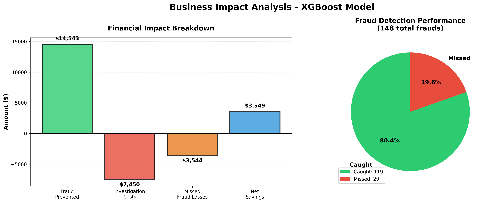

# Credit Card Fraud Detection System


## 🎯 Project Overview

Developed an end-to-end machine learning system to detect fraudulent credit card transactions in real-time, addressing the critical challenge of financial fraud prevention while minimizing false positives that impact customer experience.

**Key Achievement:** Built a production-ready XGBoost model achieving 80.4% fraud detection rate with only 0.035% false positive rate, delivering an estimated **$11,830 in annual savings** with 1.95:1 ROI on investigation costs.

---

## 📊 Business Context

Credit card fraud costs financial institutions billions annually. This project demonstrates:
- ✅ End-to-end ML pipeline development
- ✅ Handling severely imbalanced datasets (0.17% fraud rate)
- ✅ Business-focused model optimization
- ✅ Quantified financial impact analysis

---

## 📁 Dataset

- **Source:** [Credit Card Fraud Detection Dataset (Kaggle)](https://www.kaggle.com/datasets/mlg-ulb/creditcardfraud)
- **Size:** 284,807 transactions
- **Features:** 30 (anonymized via PCA + Time + Amount)
- **Target:** Binary classification (Fraud vs. Normal)
- **Class Imbalance:** 492 frauds (0.17%) vs 284,315 normal (99.83%)
- **Time Period:** 2 days of transactions

---

## 🔬 Technical Approach

### Phase 1: Exploratory Data Analysis
- Analyzed transaction patterns across temporal and monetary dimensions
- Identified severe class imbalance requiring specialized handling
- Discovered V14, V17, V12, V10 as key fraud indicators through correlation analysis
- Created 4 visualizations documenting data characteristics

### Phase 2: Feature Engineering
- **Temporal Features:**
  - Hour of day (0-23) from timestamp
  - Day number for trend analysis
- **Amount Transformations:**
  - Log transformation to handle skewness
  - Polynomial features (squared) for non-linear patterns
  - Categorical binning (Small/Medium/Large/Very Large)
- **Preprocessing:**
  - StandardScaler normalization for 6 key features
  - Stratified train-test split (70/30) maintaining fraud ratio

### Phase 3: Model Development

Implemented and compared three algorithms:

| Model | Accuracy | Precision | Recall | F1-Score | ROC-AUC | False Positives |
|-------|----------|-----------|--------|----------|---------|-----------------|
| **Logistic Regression** | 97.72% | 6.26% | 87.16% | 0.117 | 0.9724 | 1,933 |
| **Random Forest** | 99.83% | 51.49% | 81.76% | 0.632 | 0.9726 | 114 |
| **XGBoost** ⭐ | **99.93%** | **79.87%** | **80.41%** | **0.801** | **0.9662** | **30** |

**Winner: XGBoost** - Best balance of fraud detection and false positive minimization

#### Model Selection Rationale:
- Logistic Regression: High recall but unacceptable false positive rate (2.27%)
- Random Forest: SMOTE-enhanced performance with balanced metrics
- **XGBoost:** Optimal business outcome with 80% recall and 80% precision

### Phase 4: Business Impact Analysis

**Financial Metrics (Test Set):**
- Frauds Detected: 119/148 (80.4%)
- Frauds Missed: 29 (estimated loss: $3,544)
- Value of Prevented Fraud: $14,543
- Investigation Costs: $7,450
- **Net Savings: $3,549**

**Projected Annual Impact:**
- **Estimated Annual Savings: $11,830**
- ROI: $1.95 saved per $1 spent investigating
- False Positive Rate: 0.035% (30 false alarms in 85,443 transactions)

---

## 🛠️ Tech Stack

**Programming & Libraries:**
- Python 3.14
- pandas, NumPy (data manipulation)
- scikit-learn (ML algorithms, preprocessing, metrics)
- XGBoost (gradient boosting)
- imbalanced-learn (SMOTE for class imbalance)

**Visualization:**
- Matplotlib, Seaborn (statistical visualizations)

**Development Tools:**
- Jupyter Notebook (interactive development)
- Git/GitHub (version control)

---

## 📂 Project Structure
```
Credit_Card_Fraud_Detection/
│
├── data/
│   ├── creditcard.csv              # Original dataset (not included - download from Kaggle)
│   ├── X_train.csv                 # Processed training features
│   ├── X_test.csv                  # Processed test features
│   ├── y_train.csv                 # Training labels
│   ├── y_test.csv                  # Test labels
│   ├── processed_full_data.csv     # Full dataset with engineered features
│   └── model_comparison_results.csv # Model performance summary
│
├── notebooks/
│   ├── 01_data_exploration.ipynb   # EDA and visualization
│   ├── 02_feature_engineering.ipynb # Feature creation and preprocessing
│   └── 03_model_building.ipynb     # Model training, evaluation, and comparison
│
├── visualizations/
│   ├── class_distribution.png
│   ├── amount_distribution.png
│   ├── time_distribution.png
│   ├── feature_correlation.png
│   ├── confusion_matrix_lr.png
│   ├── roc_curve_lr.png
│   ├── feature_importance_rf.png
│   ├── roc_curve_comparison.png
│   ├── model_comparison_metrics.png
│   ├── confusion_matrices_comparison.png
│   └── business_impact_analysis.png
│
├── .gitignore
└── README.md
```

---

## 🚀 How to Run

### Prerequisites
```bash
pip install pandas numpy scikit-learn matplotlib seaborn imbalanced-learn xgboost jupyter
```

### Steps

1. **Clone the repository**
```bash
git clone https://github.com/yourusername/Credit_Card_Fraud_Detection.git
cd Credit_Card_Fraud_Detection
```

2. **Download dataset**
- Visit [Kaggle Dataset](https://www.kaggle.com/datasets/mlg-ulb/creditcardfraud)
- Download `creditcard.csv`
- Place in `data/` folder

3. **Run notebooks in sequence**
```bash
jupyter notebook
```
- Execute `01_data_exploration.ipynb`
- Execute `02_feature_engineering.ipynb`
- Execute `03_model_building.ipynb`

4. **View results**
- Check `visualizations/` for graphs
- Review `data/model_comparison_results.csv` for metrics
- See business impact analysis in notebook output

---

## 🔑 Key Insights

1. **Class Imbalance is Critical:** Traditional accuracy metrics are misleading with 0.17% fraud rate
2. **Feature Engineering Matters:** Temporal and amount transformations improved model performance
3. **Business-Driven Optimization:** F1-score balancing precision/recall better aligns with business goals than raw accuracy
4. **SMOTE Helps but Not Always:** Random Forest benefited from SMOTE; XGBoost performed better with class weighting
5. **False Positives are Costly:** Reducing from 1,933 (LR) to 30 (XGB) dramatically improves customer experience
6. **Top Fraud Indicators:** V14 (21.6% importance), V17, V12 emerged as strongest predictors

---

## 📈 Model Performance Visualizations

### ROC Curve Comparison


### Confusion Matrices


### Business Impact


---

## 🔮 Future Enhancements

- [ ] **Real-time API deployment** using Flask/FastAPI
- [ ] **Deep Learning models** (LSTM for sequential patterns, Autoencoders for anomaly detection)
- [ ] **Advanced ensemble methods** (Stacking, Voting Classifiers)
- [ ] **Threshold optimization** with custom business cost functions
- [ ] **Feature importance analysis** with SHAP values
- [ ] **A/B testing framework** for production deployment
- [ ] **Automated retraining pipeline** to handle concept drift
- [ ] **Dashboard** for real-time monitoring (Streamlit/Dash)

---

## 💼 Skills Demonstrated

**Machine Learning:**
- Binary classification with severe class imbalance
- Model comparison and selection (Logistic Regression, Random Forest, XGBoost)
- Hyperparameter consideration and class weighting
- Evaluation metrics (Accuracy, Precision, Recall, F1, ROC-AUC)

**Data Science:**
- Exploratory Data Analysis (EDA)
- Feature engineering and transformation
- Data preprocessing and normalization
- Statistical correlation analysis

**Business Analytics:**
- Cost-benefit analysis
- ROI calculation
- Stakeholder-focused metric selection
- Translating technical results to business value

**Software Engineering:**
- Version control (Git)
- Project documentation
- Reproducible analysis
- Code organization

---

## 👨‍💻 Author

**Swarnim Mishra**
- Email: mswarnim04@gmail.com
- LinkedIn: [Swarnim Mishra](https://www.linkedin.com/in/swarnim-mishra-84677b229)
- GitHub: [Swarnimm22](https://github.com/Swarnimm22)

---

## 📜 License

This project is for educational and portfolio purposes.

---

## 🙏 Acknowledgments

- Dataset: ULB Machine Learning Group
- Kaggle community for insights and discussions
- scikit-learn and XGBoost documentation

---

## 📞 Contact

For questions, feedback, or collaboration opportunities, feel free to reach out!

**⭐ If you found this project helpful, please consider giving it a star!**